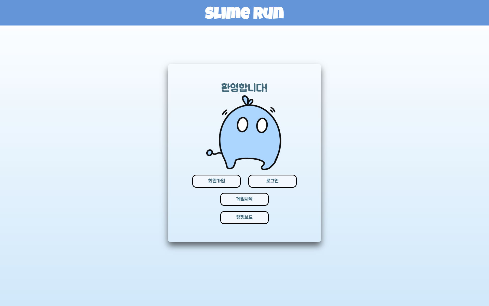

# Slime Run

- 2022년 10월 JSP 웹 프로그래밍을 학습하며 진행한 프로젝트를 재구성한 레포지토리입니다.
- Cafe24를 통해 호스팅 했던 프로젝트를 도커 컴포즈로 로컬에서 실행할 수 있도록 재구성했습니다.

## How To Play

**📍 도커 엔진이 설치되어 있어야 합니다.**

- 원하는 디렉토리에 레포지토리를 클론합니다
```
git clone https://github.com/jthugg/slimeRun.git
```

- `docker-compose.yml` 파일을 실행합니다.

```
docker-compose up -d
```

> ### 📍참고
> - 서버와 데이터 베이스가 각각 8080, 3306포트에서 실행됩니다.
> - 다른 포트에서 실행하실 원하는 경우 클론 받은 프로젝트에서 `docker-compose.yml`을 수정합니다.
> - ex) 톰캣 서버를 10000번 포트에서 실행하고싶을 경우 `docker-compose.yml`에서 다음 중 실제로 실행할 포트 번호를 수정합니다.
> ```yml
> version: '3'
> 
> services:
>   tomcat:
>     image: tomcat:latest
>     ports:
>       - "8080:8080" # {실제로 실행할 포트}:{도커 내부 포트}
>     volumes:
>       - ./webapps:/usr/local/tomcat/webapps
> ...
> ```

- `http://localhost:8080`으로 접속합니다.



## Demo


## Participant

- [Neo](https://github.com/jthugg)
- 이찬*
- 박남*

## Features

- 회원가입, 로그인/아웃
- 슬라임 런 게임
- 랭킹보드
